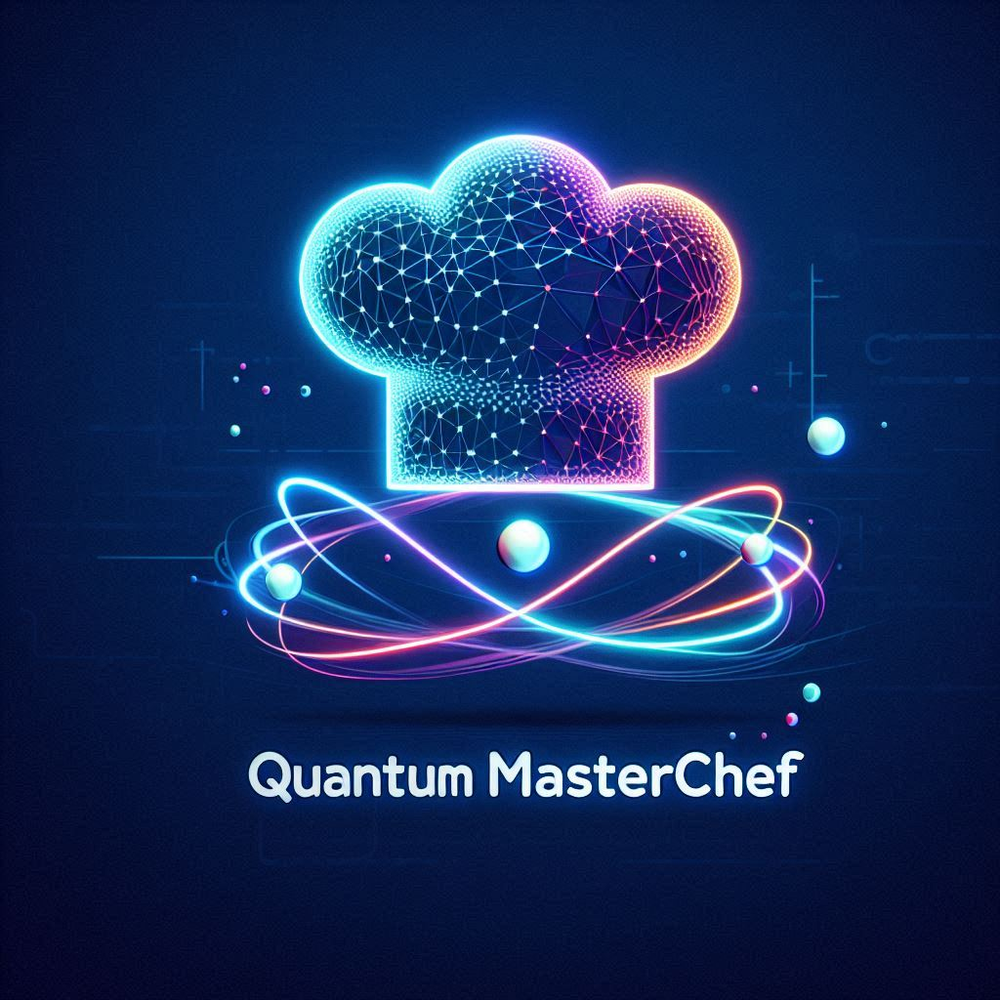

<p align="center">

</p>


Welcome to Quantum MasterChef, a unique and immersive quantum computing game that combines the excitement of culinary arts with the challenges of quantum mechanics! This game invites players to step into the world of quantum circuits and state preparation, where they'll use their knowledge and creativity to "cook" up quantum states and navigate complex puzzles.

## What is Quantum MasterChef?
Quantum MasterChef is designed to engage and educate players about qiskit and the fascinating realm of quantum computing. Drawing inspiration from cooking games and escape room challenges, your goal as a Quantum Chef is to design a quantum recipie (quantum circuit) that will transform the initial ingredient (initial statevector) into the final dish (target statevector).

## Game Objective
The primary objective is to help players learn about how to draw quantum circuits and to understand QSphere representation of statevectors in qiskit. Players must apply their understanding of quantum principles and qiskit classes to solve puzzles and advance through the game. 

The game has two modes, easy/practice mode and advanced mode. In easy mode/practice mode, players will be given relatively simple and commonly used initial and target statevectors. But in advanced mode, the game will create new statevectors each time the game is launched and these statevectors will be more complex, challenging you to refine your quantum skills and knowledge.

This game is not just for fun, it can also be used by someone who wants to teach the concepts of quantum mechanics and qiskit. And to do so, you can change the `statevector_easy` dictionary in the `statevectors.py` file according to the instructions provided and can add custom statevectors for their students.

## How to run the game?
This game will only work with `qiskit>=1.0.0`.

1. Clone the GitHub repository by using
```commandline
git clone https://github.com/shravanpatel30/Quantum-Masterchef.git
```

2. To run the game:
```commandline
python quantum_masterchef.py
```

## How to play the game?

- On the right side panel of game you will be given the initial ingredient (initial statevector) and the final dish (target statevector). The QSphere plots in the game are interactive, so feel free to rotate them for visual clarity.
- Write your quantum recipie (quantum circuit) in the textbox provided that will transform the initial ingredient to prepare the final dish.
- Below is an example of how you can prepare a recipie, this is the answer for the first easy problem:
```
from qiskit import QuantumCircuit
from qiskit.quantum_info import Statevector

qc = QuantumCircuit(2)
qc.initialize(Statevector.from_label('11'))
qc.x([0,1])
qc.draw('mpl')
```

- After you have a trial recipie (circuit), press the 'Simulate' button first. On the left side panel, this will show you how your circuit looks and the final statevector that is prepared using your recipie.
- Once you have simulated your recipie, you can go ahead and press the 'Check' button to compare your final statevector with the given final statevector.
- The game also provides hints which can be turned on or off by pressing the hint button. For advanced mode, even though the game creates new statevectors each time it is run, you will still be able to get hints for how to design your circuit.


## Important points to remember:
- Only use `.draw('mpl')` once at the end of your quantum circuit so that the game displays your quantum circuit without problems.
- To promote some good practices in creating quantum circuits using qiskit, make sure you only use `.initialize()` method to initialize your circuit (this is the best way to initialize the circuit at the start).

So, put on your chef's hat and quantum goggles, and let's start cooking up some quantum states! Are you ready to become the next Quantum MasterChef?
